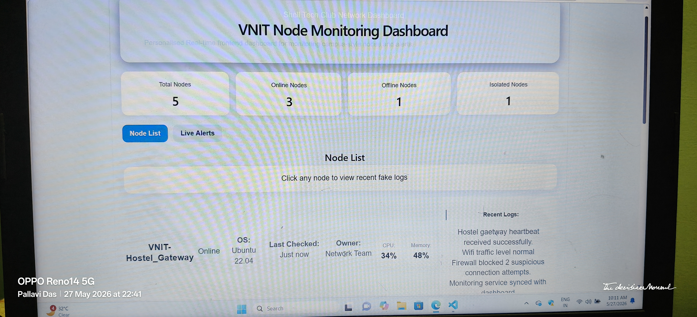
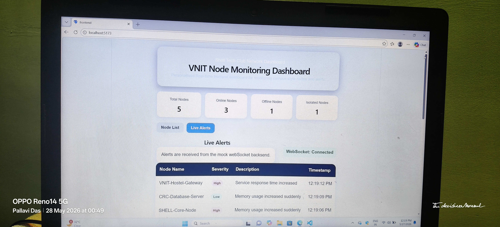
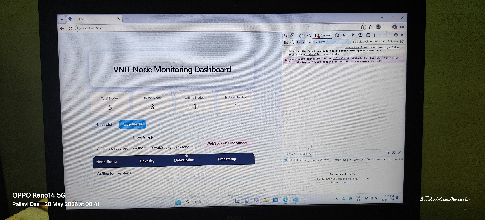

# Challenge 7: Frontend Dashboard 

## Project Title 

VNIT NODE MONITORING DASHBOARD

## My Approach

Since this was my first time working with websockets in React, I kept the architechture simple and focused on understanding real-time communication properly.

I built a personalised dashboard inspired by VNIT and SHELL-style monitoring.The dashboard has 2 main views:

- Node List 
- Live Alerts

The Node List view shows five hardcoded nodes such as VNIT-Hostel-Gateway, SHELL-Core-Node, EEE-Lab-Monitor, CRC-Database-Server, and AXIS-EvenT-Node. Each node displays its operating system, status, owner, CPU usage, last checked time, and recent logs. 

The Live Alerts view connects to a mock WebSocket backend. The backend sends fake alerts every few seconds. The frontend receives these alerts and displays them in a table, with the newest alert appearing at the top.

I used a mock backend because the challenge allowed mocked data, and this helped me understand how real-time dashboards work without making the project unnecessarily complex. 

## Tech Stack Used 

- React 
- Vite 
- JavaScript 
- CSS 
- Node.js 
- WebSocket using 'ws' 

## Personalization and Design Choices

Instead of creating a completely generic monitoring dashboard, I tried to personalize the project around VNIT campus infrastructure and SHELL-style systems so that the dashboard would feel more realistic and relatable.

I created custom node names inspired by possible VNIT monitoring systems such as:

* VNIT-Hostel-Gateway
* SHELL-Core-Node
* EEE-Lab-Monitor
* CRC-Database-Server
* Axis-Event-Node

I also customized:

* monitoring logs
* alert descriptions
* ownership labels
* server operating systems
* node statuses

to make the dashboard feel closer to a real university monitoring environment rather than a template project.

Examples include:

* suspicious login attempts
* firewall updates
* hostel gateway traffic
* CRC database backups
* SHELL core node failures

I intentionally designed the UI in a clean monitoring-dashboard style using:

* soft shadows
* responsive card layouts
* status color coding
* severity highlighting
* expandable logs
* real-time alert updates

The goal was to balance:

* beginner-friendly implementation
* understandable architecture
* realistic dashboard behavior
* personalized VNIT/SHELL-themed presentation

I also kept the frontend and backend architecture intentionally simple so that I could fully understand and explain every part of the project instead of blindly using overly complex code.

```
```

## Project Structure

```bash
challenge-07-frontend-dashboard/
├── frontend/
│   ├── src/
│   │   ├── App.jsx
│   │   ├── App.css
│   │   └── main.jsx
│   ├── package.json
│   └── vite.config.js
│
├── mock-server/
│   ├── server.js
│   └── package.json
│
├── screenshots/
│   ├── node-list-expanded.png
│   └── live-alerts.png
│
└── README.md
```


## Step-by-Step Solution

### Step 1: Created the React frontend

I created the frontend project using Vite because it provides a lightweight and fast React setup.

Command used:

```bash
npm create vite@latest frontend
```

I selected:

```bash
React
JavaScript
```

Then I installed all dependencies:

```bash
cd frontend
npm install
```

To run the frontend locally:

```bash
npm run dev
```

Output:

```bash
Local: http://localhost:5173/
```

This started the development server successfully.


### Step 2: Built the Node List dashboard view

I created a Node List section that displays five hardcoded monitoring nodes.

Each node contains:

* node name
* operating system
* node status
* CPU usage
* memory usage
* owner
* last checked time
* recent logs

Example structure:

```js
{
  id: 1,
  name: "VNIT-Hostel-Gateway",
  os: "Ubuntu 22.04",
  status: "online"
}
```

I personalized the node names and monitoring scenarios around VNIT infrastructure and SHELL-style systems to make the dashboard feel more realistic instead of using generic placeholder systems.

---

### Step 3: Added expandable node logs

I used React state to track which node card is expanded.

```js
const [expandedNode, setExpandedNode] = useState(null);
```

When a node card is clicked:

* logs become visible
* clicking again collapses the logs

This was implemented using conditional rendering.

Example:

```js
{
  expandedNode === node.id && (
    <div className="logs">
      ...
    </div>
  )
}
```

---

### Step 4: Added dashboard summary cards

I created dashboard summary cards to show:

* total nodes
* online nodes
* offline nodes
* isolated nodes

I calculated these values dynamically using JavaScript array filtering.

Example:

```js
const onlineNodes = nodes.filter(
  (node) => node.status === "online"
).length;
```

This made the dashboard feel more like a real monitoring interface.

---

### Step 5: Designed the UI using CSS

I styled the dashboard using custom CSS.

Main UI features:

* responsive grid layout
* Flexbox alignment
* hover animations
* status color badges
* severity color indicators
* shadows and rounded cards
* dashboard-style spacing

I used:

* CSS Grid for responsive layouts
* Flexbox for alignment
* dynamic CSS classes for node statuses

Example:

```css
.status-online {
  background: #dcfce7;
  color: #166534;
}
```

---

### Step 6: Built the Live Alerts view

I created a separate Live Alerts section to display real-time monitoring alerts.

I used React state to store incoming alerts.

```js
const [alerts, setAlerts] = useState([]);
```

Each alert contains:

* node name
* severity
* description
* timestamp

New alerts are added at the top of the table.

```js
setAlerts((previousAlerts) => [
  newAlert,
  ...previousAlerts
]);
```

I did this because monitoring dashboards usually prioritize the newest alerts first.

---

### Step 7: Created the mock WebSocket backend

I created a separate backend folder named `mock-server`.

Commands used:

```bash
mkdir mock-server
cd mock-server
npm init -y
npm install ws
```

Then I created:

```bash
server.js
```

The backend generates random fake alerts every few seconds and sends them through a WebSocket connection.

---

### Step 8: Connected frontend and backend using WebSocket

Inside React, I connected the frontend to the backend using:

```js
const socket = new WebSocket("ws://localhost:8000");
```

I used `useEffect` because WebSocket connection setup is a side effect.

```js
useEffect(() => {
  ...
}, [activeView]);
```

I also handled:

* successful connection
* disconnection
* connection errors
* incoming messages

---

### Step 9: Tested the complete application

I ran the backend server:

```bash
cd mock-server
node server.js
```

Then I ran the frontend:

```bash
cd frontend
npm run dev
```

Finally I opened:

```bash
http://localhost:5173
```

I verified:

* node cards render properly
* logs expand correctly
* Live Alerts connects successfully
* alerts appear every few seconds
* newest alerts appear at the top
* WebSocket connection status updates properly

---

### Step 10: Added screenshots and documentation

I created a `screenshots` folder and added:

* Node List screenshot with expanded logs
* Live Alerts screenshot with active alerts

I documented:

* architecture
* implementation steps
* WebSocket behavior
* project structure
* learning outcomes
* setup instructions

inside the `README.md` file.

```
```

## Output / Screenshots

### Node List View with Expanded Logs


This screenshot shows the Node List dashboard with one node card expanded to display recent monitoring logs.

---

### Live Alerts View Receiving Alerts



This screenshot shows the Live Alerts dashboard connected to the mock WebSocket backend and receiving live monitoring alerts in real time.

---

## What happens if the WebSocket backend goes down?

If the backend server goes down, the WebSocket connection between frontend and backend gets closed automatically.

In this situation:

* the frontend stops receiving new alerts
* the connection status changes to disconnected
* existing alerts remain visible but no new data arrives

In a production-level application, I would implement automatic reconnection handling.

One good solution is exponential backoff.

In exponential backoff:

* the frontend first retries quickly
* if reconnection repeatedly fails, the retry delay gradually increases

This prevents unnecessary repeated requests from overloading the backend server.

I would also make sure that:

* old sockets are properly closed
* duplicate WebSocket connections are avoided
* proper error messages are shown to users

---

## What I Learned

Through this challenge, I learned:

* React state management
* conditional rendering
* dynamic CSS styling
* WebSocket communication
* frontend-backend interaction
* real-time dashboard concepts
* responsive UI layouts
* how monitoring dashboards work internally

This was my first time building a real-time dashboard project, so I tried to keep the implementation understandable while still making it feel realistic and personalized.

---

## Additional Learnings Beyond the Challenge

Apart from React and WebSockets, this project also helped me become more comfortable with the complete frontend development workflow and tooling ecosystem.

### VS Code Workflow

While building this project, I learned how to:

* organize frontend and backend folders properly
* navigate project structures inside VS Code
* use the integrated terminal efficiently
* manage multiple running terminals simultaneously
* debug frontend issues using browser developer tools
* use live reload / hot reload during development
* understand console errors and trace them back to code

---

### Git and GitHub Workflow

This challenge helped me understand how GitHub-based project workflows operate in practice.

I learned how to:

* initialize Git repositories
* track project files using Git
* create commits with meaningful messages
* push projects to GitHub
* structure repositories cleanly
* maintain screenshots and documentation properly
* write professional README files using Markdown

Commands I practiced include:

```bash id="4c2m0q"
git init
git add .
git commit -m "message"
git push
```

---

### Markdown Documentation

Through this README creation process, I learned how to use:

* headings
* code blocks
* image embedding
* lists
* project structure formatting
* technical documentation style

I also understood how README files help explain projects clearly to reviewers and collaborators.

---

### Frontend Development Mindset

One important learning from this challenge was understanding the balance between:

* functionality
* readability
* simplicity
* personalization

Instead of blindly creating an overly complex project, I focused on:

* understanding the implementation
* keeping the architecture explainable
* creating a realistic user interface
* improving the presentation quality

This project helped me understand that good projects are not only about writing code, but also about:

* clear structure
* maintainability
* debugging
* presentation
* communication of ideas

---

## Networking, Browser, and Localhost Learnings 

While building this project, I also gained practical understanding of how frontend applications communicate with backend services locally.

### Understanding localhost 

Through this project, I learned that: 

localhost 

refers to the current machine itself. 

For example: 

`http://localhost:5173`

means the frontend React application is running locally on port 5173. 

Similarly:

ws://localhost:8000

means the WebSocket backend server is running locally on port 8000. 

### Understanding Ports 

This project helped me understand how ports are used in networking. 

For example: 

* Port 5173 -> frontend Vite development server
* Port 8000 -> WebSocket backend server 

I learned that different services can run simultaneously on different ports while communicating with each other.

I also learned that: 

* Incorrect ports 
* Busy ports 
* Mismatched paths 

can cause frontend-backend communication failures. 


```
``` 
### WebSocket Debugging

While testing the Live Alerts section, I initially faced a WebSocket handshake error due to incorrect backend communication and routing configuration.

I debugged the issue using browser developer tools and understood how frontend-backend communication works in real-time applications.

This helped me learn:
- WebSocket connection flow
- localhost networking
- backend route handling
- browser developer tools debugging



## Challenges Faced During Development

While building this project, I faced several practical setup and debugging issues.

Some of the challenges included:

* configuring Node.js and npm correctly
* understanding PowerShell execution policy restrictions on Windows
* learning how React project structure works
* debugging WebSocket connection failures
* understanding frontend-backend communication flow
* fixing incorrect WebSocket path configurations
* handling disconnected socket states
* understanding localhost ports and networking behavior

I also encountered situations where:

* the frontend rendered correctly but backend connections failed
* WebSocket handshake requests returned unexpected errors
* browser console errors needed careful debugging

Solving these issues helped me improve my debugging approach and taught me how important step-by-step testing is during development.

Instead of only focusing on writing code quickly, I tried to understand why each issue was happening and how different parts of the system interacted with each other.

```
```

## Possible Future Improvements

If I continue improving this project further, I would like to add:

* automatic WebSocket reconnection handling
* persistent backend storage using a database
* authentication and user login system
* dark/light mode toggle
* real CPU and memory monitoring data
* charts and analytics visualizations
* node filtering and search functionality
* alert history persistence
* sound notifications for critical alerts
* deployment using cloud platforms

I would also like to improve:

* scalability
* backend architecture
* error handling
* responsive mobile UI

Currently, the project mainly focuses on understanding React frontend workflows, state management, WebSocket communication, and real-time dashboard behavior in a simple and explainable way.

```
```


## How to Run This Project

### Run the backend server

```bash
cd mock-server
node server.js
```

---

### Run the frontend

Open another terminal:

```bash
cd frontend
npm run dev
```

---

### Open the dashboard

```bash
http://localhost:5173
```

---

## Final Notes

This project was built as part of the SHELL Tech Club Summer Project Selection Challenge.

The objective was not only to complete the challenge but also to understand how frontend dashboards, React state management, and WebSocket-based real-time systems work together.

I intentionally kept the architecture simple and readable so that I could fully understand and explain each component of the project.

```
```


## AI Usage Note

I used ChatGPT as a learning and development assistant for this project.

I used it to:

* understand WebSocket concepts
* structure the React application
* debug frontend/backend connection issues
* improve UI organization
* understand React state handling

After that, I customized the dashboard data, modified the interface, tested the application locally, and made sure I understood the purpose and behavior of each section before finalizing the project.

```
```

